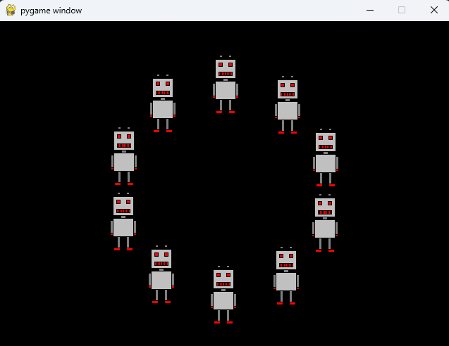

# Pygame Animations

## About
A collection of code to create basic animations in Pygame. Based on the MOOC 2024 online teaching material of University of Helsinki.

## Installation
- Ensure Python is installed on your system.
- Use pip to install all required packages listed in requirements.txt (pip install -r requirements.txt).
